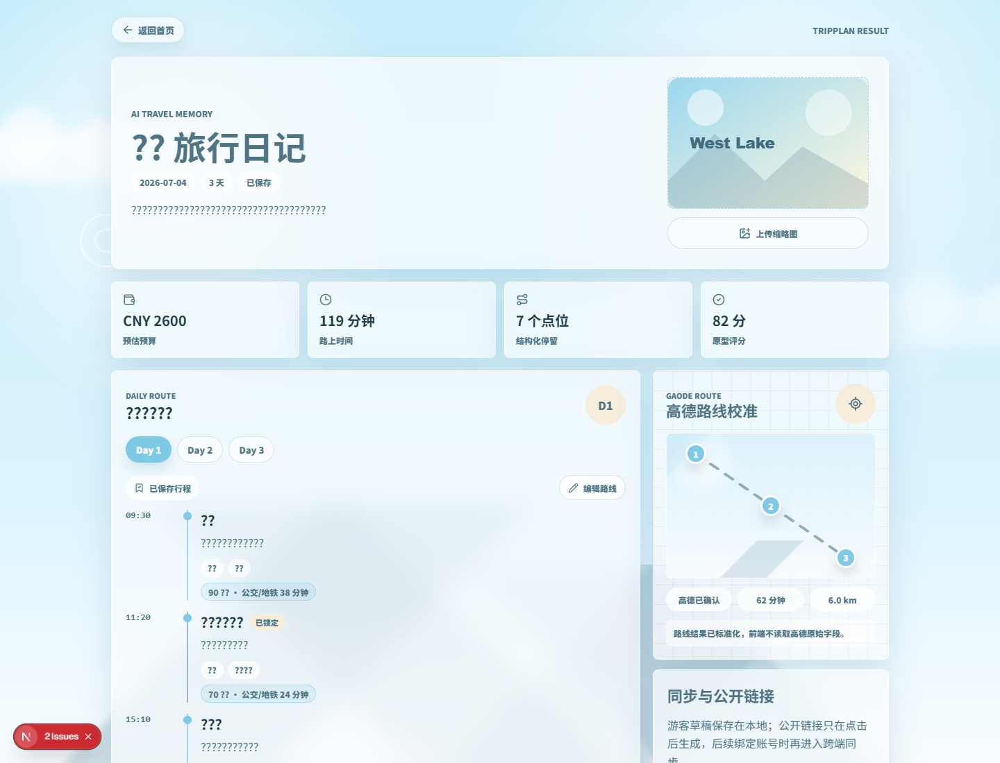
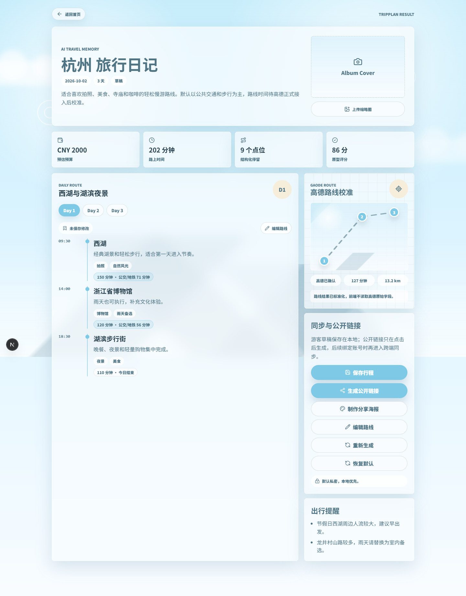
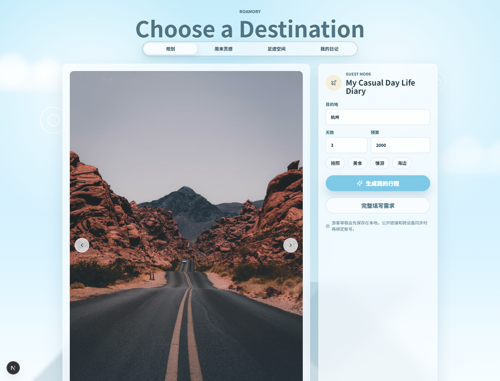
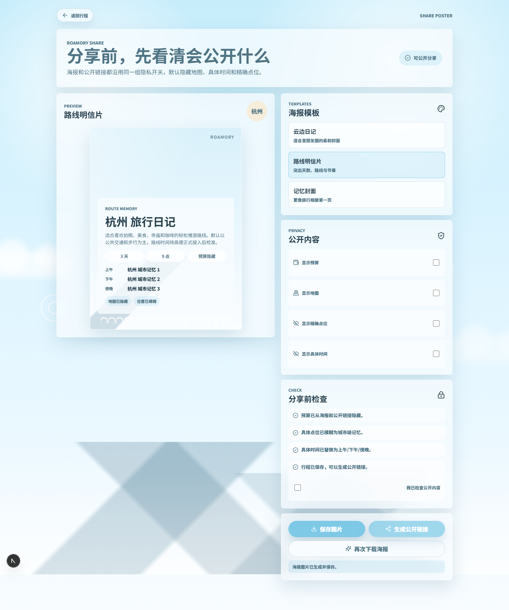
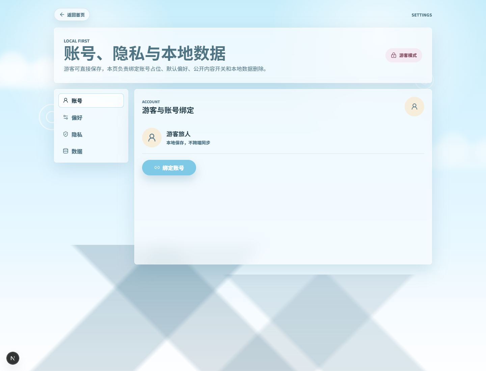

# Roamory

Roamory is a multi-end travel planning prototype. The first runnable surface is a Next.js + TypeScript Web/PWA shell that follows the blue-white watercolor reference style and validates the MVP loop with guest local storage.

## Demo Preview












## Run

```bash
npm install
npm run dev
```

Open `http://localhost:3000`.

If port `3000` is already occupied, use another port:

```bash
npm run dev -- --hostname 127.0.0.1 --port 3001
```

## Provider Configuration

Copy `.env.example` to `.env.local` for local provider tests. Do not commit real keys.

```bash
AMAP_WEB_SERVICE_KEY=your-gaode-web-service-key
NEXT_PUBLIC_AMAP_JSAPI_KEY=your-gaode-jsapi-key
NEXT_PUBLIC_AMAP_SECURITY_JS_CODE=your-gaode-jsapi-security-code
```

Current provider direction:

- China POI and routes: Gaode Web Service API as the primary provider.
- Browser map rendering: Gaode JavaScript API 2.0 through `@amap/amap-jsapi-loader`; the app falls back to the watercolor route sketch when JS API config is absent.
- Weather recommendations: Open-Meteo in Round 12.
- International route/geocoding fallback: reserved OpenRouteService adapter.
- Low-frequency development geocoding: Nominatim only as a cached fallback, not a production core path.
- AI trip generation: keep the LLM adapter replaceable; Gemini free tier or local Ollama can be wired next.

## Current Build

- Reference-image aligned homepage.
- Capsule navigation for plan, footprint space, and diary.
- Destination carousel with atmosphere selector and thumbnails.
- Guest local-storage draft flow.
- API-backed generation flow: `/create` -> `/generating` -> `/trips/mock-hangzhou`.
- TripPlan JSON Schema, mock LLM adapter, schema validation, and repair retry.
- Route calculation API at `/api/routes/calculate` with a normalized Gaode adapter boundary.
- Gaode Web Service POI search and walking/transit/driving route calls when `AMAP_WEB_SERVICE_KEY` or `GAODE_WEB_SERVICE_KEY` is configured.
- Route panel on `/trips/[tripId]` with Gaode JS SDK rendering when browser keys are configured, watercolor route fallback when they are absent, POI markers, daily route display, cache, reorder recalculation, confirmed durations when Gaode Web Service is available, and pending fallback when provider calls fail.
- Public share-link token API with a lightweight `/share/[token]` page.
- Share poster workflow at `/share-poster/[tripId]` with three fixed-ratio templates.
- Poster privacy toggles for budget, map, exact location, and exact time.
- Local PNG poster export and closeable public share links.
- Account, preference, privacy, and local data management at `/settings`.
- Guest save prompt for account binding without blocking local storage.
- Trip, Footprint, and SharePoster deletion from local data management.
- Editable itinerary result page with local save-to-planned persistence.
- Local footprint space: saving a planned trip lights its destination city.
- Manual city lighting, city privacy toggle, and `/footprints/[city]` detail pages.
- Lightweight SVG favicon to avoid missing favicon requests during browser checks.
- Server Web Service keys and browser JS API keys are kept separate; no real provider key is committed.
